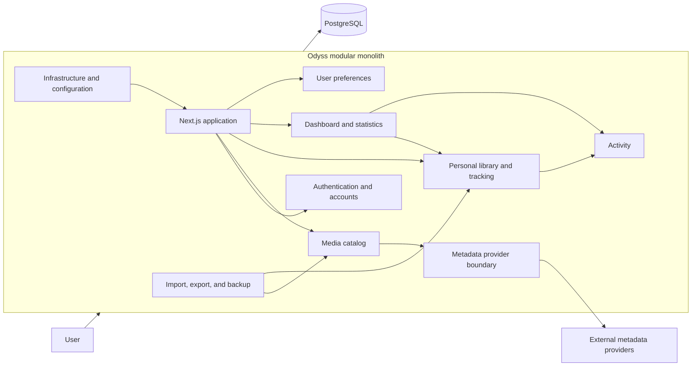

# Odyss Architecture

## Purpose

This document defines the approved technical foundation for Odyss v1. It complements the [product specification](PRODUCT_SPEC.md), [roadmap](ROADMAP.md), and individual [technical decisions](DECISIONS.md).

## Architecture Style

Odyss is a modular monolith: one repository and one deployable application with clear internal modules and dependency boundaries. It is not a collection of microservices. Odyss Cloud and self-hosted installations run the same application core; deployment-specific behavior is configuration, not a separate product or fork.

Modules should expose deliberate interfaces and keep their domain logic private. A module may use another module only through its public boundary. This structure should make responsibilities clear without introducing distributed-system complexity.

The diagram shows logical boundaries inside one deployable application, not independently deployed services.

## Approved Stack

| Area | Decision |
| --- | --- |
| Application | Next.js with the App Router |
| Language | TypeScript with strict mode |
| Runtime | Node.js 24 LTS |
| Package manager | npm |
| Database | PostgreSQL |
| Data access | Drizzle ORM with code-first schema definitions and version-controlled SQL migrations |
| Authentication | Better Auth with email and password for v1 |
| Styling | Tailwind CSS consuming Odyss-owned CSS and theme variables as design tokens |
| Boundary validation | Zod |
| Unit and component testing | Vitest and React Testing Library |
| End-to-end testing | Playwright |
| Initial self-hosting target | Docker Compose |

This stack is approved for future implementation. This document does not scaffold or configure it.

## Application Modules

- **Authentication and accounts:** identities, credentials, sessions, registration policy, and account ownership.
- **Media catalog:** internal movie, series, season, and episode entities and their provider mappings.
- **Metadata providers:** provider-independent lookup and synchronization contracts plus provider adapters.
- **Personal library:** membership, organization, display preferences, and library queries.
- **Movie tracking:** movie statuses, ratings, dates, notes, favorites, and rewatch history.
- **Series, season, and episode tracking:** series status and granular progress, including optional season logging.
- **Activity:** canonical records of relevant personal library and tracking changes.
- **Dashboard and statistics:** projections and calculations derived from canonical tracking and activity data.
- **User preferences:** theme, library presentation, and other personal settings.
- **Import/export and backup:** bounded data portability and recovery workflows approved for v1.
- **Infrastructure/configuration:** validated deployment settings, database connectivity, operational integration, and runtime concerns.

Module boundaries may be refined during data-model design, but their responsibilities must not be collapsed into provider-specific or deployment-specific implementations.

## Data Ownership and Identity

External media metadata and personal user tracking data are separate domains. Metadata describes media; it does not own a user's relationship with that media.

Odyss owns and preserves all personal tracking data, including:

- Statuses and progress
- Ratings
- Started and finished dates
- Private notes
- Favorites
- Rewatch history
- Activity

Movies, series, seasons, and episodes use internal Odyss IDs. External identifiers, including TMDB and IMDb IDs, are stored as provider mappings associated with internal entities and are never primary identifiers.

The personal library and activity records are the canonical sources for dashboard results. Dashboard statistics are calculated as projections or queries; duplicate counters must not become an independently maintained source of truth.

## Metadata Architecture

Metadata integration sits behind a provider-independent `MetadataProvider` boundary. Its contract uses internal Odyss input and output types for supported operations such as search and detail retrieval. Provider adapters translate external responses into those internal types before data reaches the catalog or tracking modules. Provider-specific response shapes must not leak into the rest of the application.

TMDB is the initial development provider and must be implemented as an adapter, not a permanent application dependency. Its use for a paid Odyss Cloud service is not commercially approved. TMDB commercial licensing and attribution requirements must be resolved before such a launch, or another production provider must be selected.

Poster and image storage, caching, delivery, attribution, and licensing remain a separate open decision. The initial metadata adapter must not make those policies implicit.

## Authentication and Accounts

Odyss Cloud and self-hosted installations use the same account model and authentication module. v1 begins with email and password authentication through Better Auth; social login is outside the initial implementation.

Deployment policy differs through configuration:

- Odyss Cloud may allow public registration.
- A self-hosted installation creates its first owner account during initial setup.
- Further self-hosted registration is disabled by default and may be enabled only through an explicit supported configuration.
- Email delivery remains configurable so each deployment can use suitable infrastructure.

## Configuration and Deployment

- Deployment differences are controlled through validated environment variables.
- Secrets are never committed to the repository.
- Cloud-specific services must not be necessary to run a self-hosted installation.
- Production deployments support operation behind a reverse proxy, including correct handling of trusted forwarding and public-origin configuration.
- Database migrations follow the same versioned process in Cloud and self-hosted environments.
- Docker Compose is the initial self-hosting target, not a second application architecture.

## Validation and Testing Boundaries

Zod validates data at application boundaries, including environment configuration, incoming requests, forms, metadata provider responses, and import data. Internal domain types remain authoritative after boundary validation.

Vitest covers units and domain behavior, React Testing Library covers user-visible component behavior, and Playwright covers critical end-to-end flows. Testing must exercise the same application core under relevant Cloud and self-hosted configurations.

## Extensibility Without Premature Implementation

The architecture should preserve reasonable future paths for generic collections with nested franchise groups and for profile progression such as achievements, ranks, XP, and cosmetics. This means maintaining stable internal IDs, clean domain boundaries, and derived progress models.

It does not authorize implementing those post-v1 features. No post-v1 screens, schemas, stored state, jobs, or user-facing behavior should be introduced before the scope is explicitly approved. Only the basic v1 achievements defined by the product specification belong to v1.
