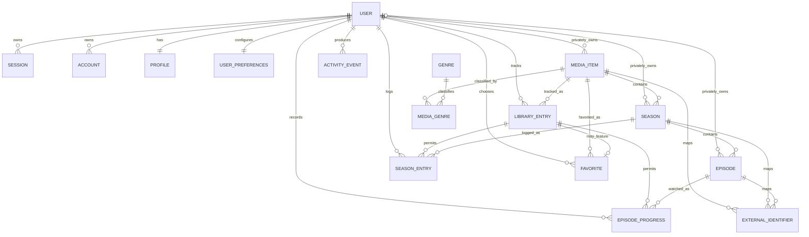

# Odyss v1 Logical Data Model

## Purpose and Scope

This document defines the initial logical, PostgreSQL-oriented data model for Odyss v1. It describes entities, relationships, ownership, and integrity rules without prescribing executable SQL, Drizzle schema code, or migrations.

The model supports the same application core in multi-user Odyss Cloud and self-hosted installations. A self-hosted installation may begin with one owner, but the model must not assume that only one user can ever exist.

## Core Principles

- Every Odyss domain entity uses an internal UUID as its primary identifier.
- Authentication identifiers follow Better Auth's owned schema; Odyss domain records reference the authenticated user ID using its compatible type.
- External provider identifiers are optional mappings and are never primary identifiers.
- Shared media metadata remains separate from personal user tracking data.
- Every user-owned domain record carries an explicit `user_id`, even when ownership could be inferred through another relationship.
- Technical event times use UTC-aware timestamps. User-entered started and finished values use date-only values so timezone conversion cannot change the intended day.
- Dashboard counters, watched totals, and completion percentages are derived rather than canonical stored values.
- Foreign keys, uniqueness rules, checks, restrictive deletion defaults, and database-backed ownership enforcement are preferred over UI assumptions.
- Queries and mutations must enforce user scope at the data-access boundary so one user cannot read or change another user's records.

## Ownership and Data Boundaries

The model has three ownership zones:

| Zone | Ownership | Examples | Boundary |
| --- | --- | --- | --- |
| Authentication | Better Auth | User, Session, Account, Verification | Better Auth owns credentials and exact schema. |
| Shared catalog | Odyss installation | Shared MediaItem, Season, Episode, ExternalIdentifier, Genre | Readable across authorized users; unaffected by deletion of one user. |
| Personal/private | One user | Profile, preferences, tracking records, activity, private manual media | Every row is explicitly user-scoped and inaccessible to other users. |

A private manual `MediaItem` and its season or episode descendants each carry explicit owner scope. Every lookup that crosses from personal data to catalog data must accept only either a shared item or a private item owned by the same user. The physical schema must enforce matching ownership throughout the hierarchy with composite relationships, constraint triggers, or an equally strong database mechanism. Domain services must independently authorize every operation. PostgreSQL row-level security may be added as defense in depth but must not be the only protection; UI filtering is never sufficient.

Direct relationships between two user-owned tables use same-user composite references where practical. Dependent personal records carry `user_id` and are constrained so it agrees with the owning parent record. Authorization checks always begin from the authenticated user ID, never from a client-supplied user ID.

### Ownership-Enforcement Matrix

| Entity | Owner scope | Database relationship or constraint | Domain-service authorization | RLS defense in depth |
| --- | --- | --- | --- | --- |
| Profile and UserPreferences | Exactly one authenticated user | Foreign key to Better Auth `User`; unique `user_id`; delete through the account lifecycle | Read and mutate only for the authenticated user | May restrict rows to matching `user_id` |
| LibraryEntry | Exactly one authenticated user | Foreign keys to `User` and `MediaItem`; unique user/media pair; database-enforced check that the media is shared or owned by that user | Authorize the user and media visibility on every read and mutation | May enforce user scope and visible-media predicate |
| SeasonEntry | Exactly one authenticated user and its parent series library entry | Foreign keys to `User` and `Season`; required same-user `LibraryEntry` relationship for the season's parent series; unique user/season pair | Verify user, season ancestry, media visibility, and parent library membership in one transaction | May restrict by `user_id` and reachable parent ownership |
| EpisodeProgress | Exactly one authenticated user and its parent series library entry | Foreign keys to `User` and `Episode`; required same-user `LibraryEntry` relationship for the episode's parent series; unique user/episode pair | Verify user, episode ancestry, media visibility, and parent library membership in one transaction | May restrict by `user_id` and reachable parent ownership |
| Favorite | Exactly one authenticated user and matching library entry | Composite foreign key from user/media pair to `LibraryEntry`; unique user/media pair; removed with the parent entry | Verify ownership of the matching library entry before creation or reordering | May restrict rows to matching `user_id` |
| ActivityEvent | Exactly one authenticated user; target is a visible durable catalog entity | Foreign key to `User`; database-backed target integrity for exactly one MediaItem, Season, or Episode; private target owner must match event user | Authorize target visibility and emit only after the canonical mutation succeeds | May restrict rows by `user_id` and private-target ownership |
| Shared catalog MediaItem, Season, and Episode | Installation-owned; no private owner | Owner fields are null; parent foreign keys and subtype constraints preserve the hierarchy | Only trusted catalog operations may create, refresh, or remove shared metadata | May permit authenticated reads while restricting catalog writes |
| Private manual MediaItem | Exactly one authenticated owner | Foreign key from non-null owner to `User`; catalog-scope/owner consistency check; no external mappings | Authorize the owner for every create, read, update, and delete | May restrict rows to matching owner |
| Private manual Season | Same explicit owner as parent private series | Non-null owner plus database-enforced equality with parent series owner; parent must be a series | Authorize owner and parent series on every operation | May restrict through explicit owner and parent scope |
| Private manual Episode | Same explicit owner as parent private season and series | Non-null owner plus database-enforced equality with parent season and series owners | Authorize owner and full ancestry on every operation | May restrict through explicit owner and parent scope |

The final physical mechanism for conditional shared-or-private catalog references is selected during schema design. Ordinary foreign keys cover existence, same-user personal relationships, and straightforward cascades; composite relationships or constraint triggers cover cross-table owner and subtype predicates. RLS, if used, supplements rather than replaces these constraints and domain authorization.

## Relationship Overview

The authentication relationships shown are conceptual; Better Auth owns their exact representation, including `Verification`. `ExternalIdentifier` and `ActivityEvent` have logical polymorphic targets. Their preferred physical integrity strategies are described below rather than implied by the compact diagram.

## Authentication-Owned Entities

Better Auth owns the exact definitions and migrations for `User`, `Session`, `Account`, and `Verification`. Odyss must integrate with the supported Better Auth schema instead of copying or altering credential storage in domain tables.

### User

The authenticated identity and root of user ownership. Odyss tables reference its ID but do not duplicate its password, credential hashes, verification secrets, or provider-account credentials.

### Session

An authentication session owned by a user. Session lifecycle and fields remain under Better Auth.

### Account

Authentication account data associated with a user. v1 uses email and password, but the exact representation remains Better Auth-owned.

### Verification

Temporary verification state managed by Better Auth, such as tokens required by supported authentication flows. Odyss domain logic must not treat it as profile or activity data.

Deleting an authentication user must invoke the controlled domain deletion workflow described below. The integration must not leave orphaned Odyss records if Better Auth and domain cleanup occur across separate operations.

## Odyss Profile

### Profile

`Profile` is the Odyss-facing personal identity and is separate from authentication credentials.

Logical attributes:

- Internal UUID
- Authenticated `user_id`
- Display name and other approved public-facing profile fields
- UTC created and updated timestamps

Rules:

- Exactly one profile per user, enforced by uniqueness on `user_id`.
- The profile must not duplicate email/password credentials or verification state.
- Social graph, rank, XP, and cosmetic-frame state are not part of v1.

### UserPreferences

`UserPreferences` contains user-owned presentation and localization settings.

Logical attributes:

- Internal UUID
- Authenticated `user_id`
- Theme choice limited to the approved standard light and dark themes
- Locale
- IANA timezone identifier
- Default library layout: list, compact, or grid
- Basic library grouping and individual-season display preferences
- Approved default sorting and filtering preferences
- UTC created and updated timestamps

Rules:

- Exactly one preferences record per user, enforced by uniqueness on `user_id`.
- Values are validated against supported choices.
- No arbitrary theme tokens, CSS, or full theme-editor state belongs here in v1.

## Media Catalog

### MediaItem

`MediaItem` is the internal catalog identity for exactly one movie or one TV series. A series is not modeled as a movie with episodes; the media-type discriminator determines which invariants apply.

Logical attributes:

- Internal UUID
- Media type: `movie` or `series`
- Catalog scope: shared or private manual
- Nullable owner `user_id`
- Normalized core metadata required by Odyss, such as titles, synopsis, relevant release dates, runtime information, and availability-independent descriptive fields
- Optional poster/image reference pending the final image model
- UTC created and updated timestamps

Rules:

- Shared media has no owner; `owner_user_id` must be null.
- Private manual media has exactly one owner; `owner_user_id` must be non-null.
- Private manual media is visible only to its owner.
- Shared provider-backed media may have optional provider mappings.
- Private manual media cannot have provider mappings in v1.
- Promotion, merging, and deduplication between private manual and shared media are deferred; v1 never changes catalog scope or merges them automatically.
- A movie cannot own seasons or episodes.
- A series may own seasons, which then own episodes.
- Provider refreshes update normalized catalog metadata without overwriting personal tracking data.

### Season

`Season` belongs to one series `MediaItem`.

Logical attributes:

- Internal UUID
- Parent series ID
- Nullable owner `user_id`
- Season number
- Normalized title, synopsis, release information, and other approved season metadata
- Optional season-specific poster reference pending the final image model
- UTC created and updated timestamps

Rules:

- The parent `MediaItem` must have media type `series`.
- A shared season has no owner. A private manual season has an explicit owner that must equal its parent series owner.
- The physical schema must prevent a season from referencing a movie. It must use either a composite discriminator foreign key or a database-enforced series subtype table; the final choice is deferred to physical schema design. UI validation is insufficient.
- Season number is unique within its parent series.
- The handling of specials and season number zero remains open.
- A season under private manual media inherits that media item's owner and visibility.

### Episode

`Episode` belongs to one `Season`.

Logical attributes:

- Internal UUID
- Parent season ID
- Nullable owner `user_id`
- Episode number
- Normalized title, synopsis, air date, runtime, and other approved episode metadata
- UTC created and updated timestamps

Rules:

- Episode number is unique within its parent season.
- A shared episode has no owner. A private manual episode has an explicit owner that must equal both its parent season owner and parent series owner.
- Its series and visibility follow the parent hierarchy, with database-enforced owner consistency for private manual records.
- An episode cannot exist without a season.

### ExternalIdentifier

`ExternalIdentifier` logically maps a `MediaItem`, `Season`, or `Episode` to an external provider record.

Logical attributes:

- Internal UUID
- Target type: media item, season, or episode
- Internal target UUID
- Provider key, such as TMDB or IMDb
- Provider entity kind or namespace, such as movie, series, season, or episode
- Provider's external identifier stored as an opaque string
- UTC created and updated timestamps

Required uniqueness:

- A provider identifier maps to at most one internal entity in the same provider namespace: unique provider, provider entity kind, and external ID. This prevents a movie and series namespace that reuse the same numeric value from colliding.
- An internal target has at most one mapping for the same provider and provider entity kind unless a later provider contract explicitly requires otherwise: unique target type, target ID, provider, and provider entity kind.
- Provider keys use one canonical lowercase representation.
- The relevant provider adapter trims and canonically normalizes each external ID before persistence. External IDs are not lowercased blindly because providers may define different case semantics.
- Uniqueness applies to the canonical normalized values.
- Mappings target shared catalog entities only in v1; database constraints must reject mappings to private manual media.

A single polymorphic table cannot provide strong ordinary foreign keys from one `target_id` column to three target tables. The preferred physical implementation is therefore three mapping tables—one each for media items, seasons, and episodes—with real foreign keys, while the domain exposes one `ExternalIdentifier` concept. This preserves cascade/restrict behavior and prevents mappings to nonexistent or mismatched entities.

Provider-specific payloads may be retained only under a separately approved metadata-cache strategy. They must never leak into `LibraryEntry`, `SeasonEntry`, `EpisodeProgress`, `Favorite`, or other personal tracking tables.

### Genre and MediaGenre

`Genre` is a normalized catalog classification with an internal UUID, canonical name, optional stable slug, and UTC timestamps. Canonical name or slug uniqueness prevents duplicate normalized genres.

`MediaGenre` is the many-to-many relationship between `MediaItem` and `Genre`. It has an internal UUID and unique media-item/genre pairing. Removing a classification removes the join row, not the media item, genre, or any personal tracking record.

## Personal Library

All entities in this section have an internal UUID and explicit authenticated `user_id`. Every read and mutation is scoped by that user ID.

### LibraryEntry

`LibraryEntry` represents one user's current relationship with one movie or series.

Logical attributes:

- Internal UUID
- User ID
- Media item ID
- Status: `plan_to_watch`, `watching`, `completed`, `on_hold`, or `dropped`
- Nullable integer rating from 1 through 10
- Nullable date-only started date
- Nullable date-only finished date
- Non-negative integer rewatch count, defaulting to zero
- Nullable private notes
- UTC created and updated timestamps

Rules:

- A user has at most one library entry per media item, enforced by unique user/media-item pairing.
- Finished date cannot be earlier than started date when both exist.
- The referenced media item must be shared or private manual media owned by the same user.
- Private notes are never catalog metadata, activity payload content, or visible to another user.
- Changing status never deletes season or episode progress.
- Removing a library entry explicitly removes its `Favorite` and must remove its dependent `SeasonEntry` and `EpisodeProgress` records in the same controlled transaction so none can remain without their parent library entry.

For a movie, status and dates describe the movie viewing state; rating, notes, favorite status, and rewatch count apply to the movie. No season or episode progress is valid.

For a series, status and dates describe the series-level relationship, while watched episodes provide granular progress. Rating, notes, favorite status, and rewatch count apply to the series as a whole in v1. Series `completed` is explicit user state informed by episode progress, not a stored completion percentage. Rewatch count is a summary count only; v1 does not create a detailed viewing-history system.

### SeasonEntry

`SeasonEntry` provides optional personal season-level logging. It is not required for ordinary series or episode tracking and must not be auto-created solely because episode progress exists.

Logical attributes:

- Internal UUID
- User ID
- Season ID
- Season-level status using the approved status values
- Nullable date-only started date
- Nullable date-only finished date
- UTC created and updated timestamps

Rules:

- A user has at most one season entry per season, enforced by unique user/season pairing.
- Finished date cannot be earlier than started date when both exist.
- The season's series must be shared or private manual media owned by the same user.
- A matching series `LibraryEntry` for the same user must exist. `SeasonEntry` cannot exist independently from that parent relationship.
- A user action that creates season logging must add the parent series first or create the `LibraryEntry` and `SeasonEntry` in one transaction.
- The physical schema must enforce the same-user parent-series relationship with composite relationships, constraint triggers, or an equally strong mechanism; domain authorization is also required.
- Season rating and private notes remain an open product decision and are not modeled as approved v1 fields.
- Season completion percentage is derived and never stored.

### EpisodeProgress

`EpisodeProgress` records one user's current watched state for one episode.

Logical attributes:

- Internal UUID
- User ID
- Episode ID
- Watched boolean
- Nullable UTC watched timestamp
- UTC created and updated timestamps

Rules:

- A user has at most one progress record per episode, enforced by unique user/episode pairing.
- An unwatched record has no watched timestamp. Whether the timestamp means viewing time or registration time remains an open decision.
- The episode's series must be shared or private manual media owned by the same user.
- A matching series `LibraryEntry` for the same user must exist. `EpisodeProgress` cannot exist independently from that parent relationship.
- A user action that creates episode progress must add the parent series first or create the `LibraryEntry` and progress records in one transaction.
- The physical schema must enforce the same-user parent-series relationship with composite relationships, constraint triggers, or an equally strong mechanism; domain authorization is also required.
- Season and series watched totals and completion percentages are derived from episode records and catalog episode counts.

A bulk action such as “mark through episode 6 watched” resolves the affected internal episode IDs and inserts or updates one `EpisodeProgress` row per episode in a transaction. It does not store `current_episode`, `episodes_watched`, or another aggregate progress number. Reversing a bulk action updates or removes the affected canonical episode records according to the domain rule.

### Favorite

`Favorite` represents one user's choice to feature a movie or series.

Logical attributes:

- Internal UUID
- User ID
- Media item ID
- Non-negative display position
- UTC created and updated timestamps

Rules:

- A user may favorite a media item only once, enforced by unique user/media-item pairing.
- A matching `LibraryEntry` for the same user and media item must exist, enforced through the user/media pair rather than UI behavior.
- Removing the parent `LibraryEntry` also removes its `Favorite`.
- Display position is unique within a user's favorites so Dashboard ordering is deterministic; reorder operations update positions transactionally.
- The media item must be shared or private manual media owned by the same user.
- Season and episode favorites are outside v1.

### ActivityEvent

`ActivityEvent` records a meaningful, immutable user action for Recent Activity and possible future extensions. It is an audit-like product feed, not the canonical source for current status, rating, favorite state, or episode progress. v1 targets are restricted to durable catalog entities: `MediaItem`, `Season`, and `Episode`.

Logical attributes:

- Internal UUID
- User ID
- Target type: media item, season, or episode
- Target internal UUID
- Event type
- UTC event timestamp
- Minimal structured metadata validated for the event type

Initial event types cover:

- Adding media
- Changing status
- Rating media
- Completing a movie
- Completing a season
- Completing a series
- Changing episode progress
- Changing favorites

The payload may contain minimal presentation context or a non-sensitive before/after value needed to explain the event. The event type and payload describe actions involving a `LibraryEntry`, `SeasonEntry`, `EpisodeProgress`, or `Favorite`; those temporary personal rows are never activity targets. The payload must not contain private notes, authentication data, provider credentials, full provider responses, or other sensitive values.

Because the target can be a media item, season, or episode, a bare polymorphic UUID cannot provide complete foreign-key integrity. Physical design should prefer explicit nullable target foreign keys with a constraint requiring exactly one target, or target-specific child records, over an unchecked target ID. If a generic target pair is retained, a database constraint trigger and domain validation are required. Exact payload schemas remain open.

Activity targeting private manual media must have the same user owner. Deleting private manual media deletes activity targeting that media or its children in the same transaction. Shared catalog deletion remains restricted while activity or other personal records reference the target.

## Manual Media

Manual entries use the ordinary internal `MediaItem` hierarchy. A manually entered series can have manual seasons and episodes without provider identifiers.

- Manual media is private to its creating owner by default.
- Private manual media cannot have an `ExternalIdentifier` in v1.
- The media item's owner ID is mandatory and immutable except through a future explicit ownership-transfer rule.
- Private manual seasons and episodes carry explicit owner IDs matching the complete parent hierarchy; shared catalog children have null private owners.
- Database-enforced parent/child ownership consistency and domain-service authorization are both required. RLS may supplement but never replace them.
- Shared provider-backed and private manual records have distinct catalog scopes and provider-mapping rules, so provider uniqueness cannot collide across them.
- Promotion, merging, and deduplication of manual media are deferred and never occur automatically in v1.
- Search, detail, library, progress, favorite, activity, export, and deletion operations must scope private manual media to its owner.
- No user may reference, discover, or infer another user's private manual media through IDs, search, counts, errors, or activity.

Deleting a user removes that user's personal records before deleting their owned manual media hierarchy. Shared media has no owner and is never selected by this deletion path.

## Deletion and Referential Integrity

### User Deletion

Better Auth and the Odyss domain use the same PostgreSQL database. Account deletion is an idempotent domain operation that removes:

- Profile and preferences
- Library and season entries
- Episode progress
- Favorites
- Activity events
- Private manual media owned by the user, including its seasons, episodes, and genre joins
- Better Auth-owned sessions, accounts, verification data, and user record according to Better Auth's supported lifecycle

User-owned Odyss data is removed or cascaded before the final Better Auth `User` row is deleted. Shared catalog media survives. The workflow uses one database transaction where supported and is safe to retry: each step tolerates already-removed records and resumes incomplete cleanup without touching shared catalog data. Database foreign keys and ownership predicates prevent partial deletion from exposing or orphaning private data. The exact retention or grace period before this operation remains open.

### Catalog Deletion

Catalog removal is restrictive by default:

- A shared catalog item referenced by personal data cannot be hard-deleted through an ordinary operation.
- Provider disappearance or staleness does not by itself delete the internal media item.
- A series is removed with its seasons and episodes only through an explicit controlled operation that first resolves dependent mappings and personal records.
- Deleting private manual media also deletes same-owner activity targeting that media or its children.
- Hard deletion must not leave personal rows pointing to missing media, seasons, or episodes.

The preferred v1 integrity strategy is to retain referenced shared catalog entities, marking them unavailable for metadata refresh or normal discovery if necessary. If an administrator explicitly hard-deletes an unreferenced catalog hierarchy, the operation removes children and mappings in a transaction. A future policy for referenced-item removal must choose archival, personal snapshot retention, or explicit dependent-data deletion before such hard deletion is allowed.

### Relationship Actions

- User-owned records cascade only from deletion of their authenticated user through the controlled account-deletion path.
- Shared catalog foreign keys restrict deletion while personal references exist.
- Season and episode removal is restricted outside the controlled parent-catalog operation.
- External mapping and media-genre rows may be removed with their catalog target during that controlled operation.
- Ownership checks accompany foreign-key checks for every personal-to-catalog relationship.

## Status and Progress Semantics

`LibraryEntry.status` and `SeasonEntry.status` are explicit user-controlled workflow states. `EpisodeProgress` is the only canonical granular progress source and determines watched totals and season or series completion percentages.

Explicit status and episode-derived progress may differ. For example, a user may explicitly keep a series in `watching` when all currently known episodes are watched, or mark a season `completed` independently from its derived percentage. Dashboard status totals use `LibraryEntry.status`; completion percentages use `EpisodeProgress` and catalog episode counts.

Odyss may present a consistency suggestion but must not silently change an explicit status in v1. Status changes never delete or rewrite episode progress. Automatic reconciliation remains an open later product decision.

## Mutation and Concurrency Rules

- Personal-data mutations run in database transactions.
- Episode bulk updates perform transactional per-episode upserts against resolved internal episode IDs.
- Database uniqueness on the user/episode pair prevents duplicate progress records.
- Overlapping v1 progress updates use last-committed-write behavior for each affected episode.
- Mutation APIs return the resulting canonical state after the transaction commits so clients do not assume their submitted state won a concurrent update.
- Favorite reordering is transactional. The physical schema must use deferrable position uniqueness or another collision-safe reorder mechanism so intermediate positions do not violate uniqueness.
- These rules define behavior only; locking strategy and schema implementation remain part of physical design.

## Business Rules

- A `movie` MediaItem cannot own seasons or episodes.
- A `series` MediaItem may own seasons; every season must belong to a series.
- Every episode must belong to a season.
- Finished date cannot be earlier than started date.
- Rating is nullable and, when present, is an integer from 1 through 10.
- Rewatch count and favorite display position are non-negative integers.
- `completed` status changes canonical tracking state but creates no duplicated dashboard counter.
- Series completion combines derived episode completion with explicit series status; no stored percentage is authoritative.
- Any future automatic status change must be explicit domain-service behavior, never a database or UI assumption; v1 performs no silent automatic change.
- Marking every episode watched may produce a status suggestion but does not silently complete a season or series in v1.
- Changing a series status never silently destroys episode progress.
- Cross-entity mutations, including bulk progress and account deletion, use transactions and produce activity only after canonical writes succeed.

## Derived Data

The following are calculated from canonical catalog, library, progress, favorite, and activity records rather than stored as authoritative values:

- Watched episode totals
- Season completion percentage
- Series completion percentage
- Completed-title totals
- Status distribution
- Days watched
- Genre profile
- Dashboard insights

Other dashboard projections, including overview values and achievement eligibility, follow the same rule. For example, watched episode totals come from watched `EpisodeProgress` rows, while status distribution comes from current `LibraryEntry` statuses.

Performance work may later introduce caches, materialized views, or rebuildable projections. Such structures must be invalidatable and reconstructable from canonical data and must never become an independent source of truth.

## v1 Requirement Coverage

| Requirement | Canonical model |
| --- | --- |
| Five tracking statuses | `LibraryEntry.status`; optional `SeasonEntry.status` |
| Ratings from 1 to 10 | Nullable constrained `LibraryEntry.rating` |
| Started and finished dates | Date-only fields on `LibraryEntry` and optional `SeasonEntry` |
| Rewatch count | Non-negative `LibraryEntry.rewatch_count`; no detailed history in v1 |
| Private notes | `LibraryEntry.private_notes`, always user-scoped |
| Episode and season progress | Canonical `EpisodeProgress`; percentages derived |
| Optional individual-season logging | `SeasonEntry`, independent of ordinary progress |
| Series-grouped or individual-season display | `UserPreferences` plus catalog `Season` rows; `SeasonEntry` enriches the display but remains optional |
| Favorites with Dashboard ordering | Unique `Favorite` with display position |
| Recent Activity | Non-canonical `ActivityEvent` records |
| Quick Add, Add with Details, and Manual Entry | `LibraryEntry` plus shared or owner-private `MediaItem` |
| Season-specific posters | Conceptual `Season` poster reference pending the image-model decision |
| Dashboard statistics and insights | Derived queries or rebuildable projections |

Library search, filters, sorting, and layouts are query and preference behavior over these canonical records; they do not require duplicate library or statistics tables.

## Open Data-Model Decisions

- Exact normalized image and poster model
- Metadata refresh and stale-data strategy
- Whether season-level ratings and private notes enter v1
- Rules for specials and season number zero
- Whether watched timestamps represent actual viewing time or registration time
- Exact activity payload schemas
- Future automatic status-reconciliation rules based on progress
- Promotion, merging, and deduplication rules for private manual media
- Future detailed watch and rewatch history
- Import conflict-resolution rules
- Data retention and account-deletion grace periods

Until approved, these items must not be encoded as irreversible schema assumptions or expanded product scope.
